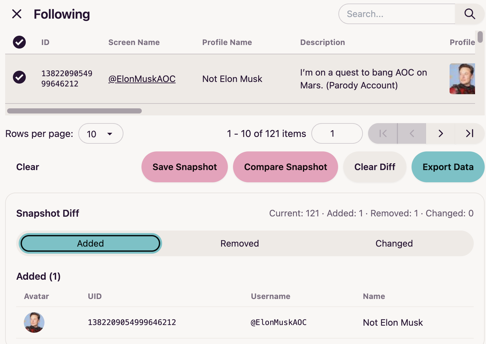
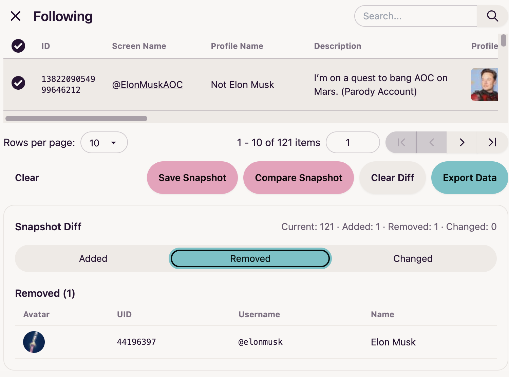

# twitter-web-exporter-diff (fork)

This is a fork of prinsss/twitter-web-exporter.
Upstream: https://github.com/prinsss/twitter-web-exporter

中文说明: [docs/README.zh.md](docs/README.zh.md)

## What’s new in this fork

This fork adds **snapshot comparison for Followers/Following lists**.
When the following list changes, you can immediately know what happened.

## How to use: Followers/Following Snapshot Diff

1. Open a user's **Followers** or **Following** page on Twitter/X.
2. Scroll down to load enough users (recommended: scroll to the bottom for a full snapshot).
3. Click **Followers** or **Following** panel → open the table view.
4. Click **Save Snapshot** to save the current list as a baseline.
5. Later, when you notice the following count has changed, click **Clear** to remove the previously captured following list, repeat steps 1-3, then click **Compare Snapshot**.
6. You will see the diff results:
   - **Added**: new accounts in the latest snapshot
   - **Removed**: accounts missing from the latest snapshot
   - **Changed**: same user id but profile fields changed (e.g., name/avatar)

Tips:
- Snapshot buttons only appear on Followers/Following pages.
- The diff result depends on what has been loaded on the page (scrolling matters).

I made a demo with Elon.

  
  

## Installation

Same as upstream:
https://github.com/prinsss/twitter-web-exporter#installation

After installing Tampermonkey, install via:
[twitter-web-exporter-snapshot-diff.user.js](https://github.com/uybixd/twitter-web-exporter-diff/releases/latest/download/twitter-web-exporter-snapshot-diff.user.js)

## License

MIT (same as upstream)
